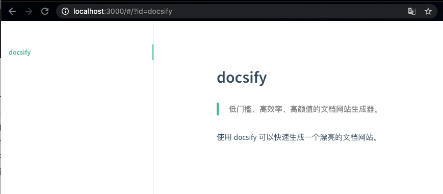

# docsify - 低门槛、高效率、高颜值的静态网站生成器


**基本信息**

| 工具名称 | docsify                              |
| :------- | :----------------------------------- |
| 当前版本 | 4.11.6                               |
| 开发语言 | JavaScript                           |
| 适用平台 | macOS、Linux、Windows                |
| 开源地址 | https://github.com/docsifyjs/docsify |
| 官方文档 | https://docsify.js.org/              |


# 准备环境

安装 docsify 命令行工具：

```shell
npm i docsify-cli -g
```

# 快速入门

STEP 1. 初始化文件夹，如：docsify-guide

```shell
# 1. 创建新文件夹 docsify-guide
$ mkdir docsify-guide

# 2. 初始化 docsify-guide
$ docsify init ./docsify-guide

# 3. 进入
$ cd docsify-guide

# 4. 查看初始化后的文件列表
$ tree -a -C
.
├── .nojekyll   # 用于阻止 GitHub Pages 忽略掉下划线开头的文件
├── README.md   # 会做为主页内容渲染
└── index.html  # 入口文件
```

STEP 2. 编辑 README.md

```md
# docsify 

>  低门槛、高效率、高颜值的文档网站生成器。

使用 docsify 可以快速生成一个漂亮的文档网站。
```


STEP 3. 启动本地服务，实时预览效果。

```shell
$ docsify serve .
```

效果如下图所示：




# 修订历史